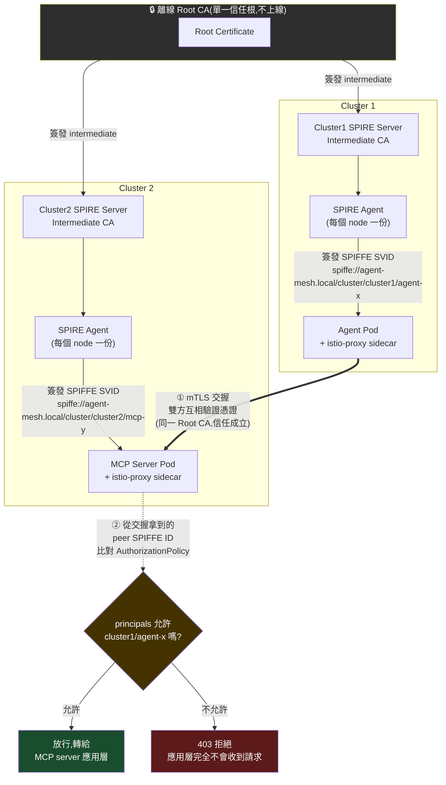

# 為什麼 Agent Mesh 需要跨叢集 mTLS

## 問題:agent 跟 MCP server 之間,怎麼證明「你是誰」

當 agent 分散在多個叢集、MCP server 也分散在多個叢集,任何一次呼叫發生時,
接收端都要能回答一個問題:「打進來的這個東西,究竟是哪座叢集的哪個
agent?」——不是「哪個 IP」,是「哪個身份」。

單一叢集內,這件事勉強可以靠 k8s NetworkPolicy、namespace 隔離、
ServiceAccount 這些手段湊合。但一旦跨叢集:

- **IP 不可信**:pod 重新排程、叢集網路重疊、NAT/gateway 轉發之後,來源
  IP 早就不代表「誰在講話」
- **網路層卡控天花板很低**:NetworkPolicy 只能講「這個網段可不可以打到那個
  網段」,講不出「這個特定 agent 可不可以打這個特定 MCP server」這種細
  粒度的授權語言
- **沒有可驗證的身份,就沒有真正的存取控制**:MCP server 端如果沒辦法
  密碼學等級地驗證對方身份,那麼「限制哪些 agent 可以存取哪些 MCP
  server」這句話就只是防君子不防小人的門面設定

## 解法:mTLS + SPIFFE——用密碼學身份取代網路位置

**mTLS(雙向 TLS)**讓連線的兩端都要出示憑證、都要被對方驗證,不是只有
client 驗 server。**SPIFFE**則是這張憑證裡要「寫什麼」的規格——每一份
憑證的 SAN(Subject Alternative Name)裡都帶一個結構化的
`spiffe://<trust-domain>/...` URI,精準指出「這是哪個 trust domain 底下
的哪個 workload」。

兩者合起來的效果:agent 打給 MCP server 的每一次連線,MCP server 都能從
mTLS 交握本身(不是 header、不是 token、不是應用層自己傳的欄位)拿到一個
**沒辦法偽造的**、對方的 SPIFFE 身份字串,再拿這個身份字串去比對「這個
身份允不允許呼叫我」——這正是我們稱它「agent mesh」的原因:每個 agent
和每個 MCP server 都是這張網裡的一個有密碼學身份的節點,節點跟節點之間
的每一次溝通都要通過身份驗證,不是單純的網路可達性。

在我們的架構裡,這個「允不允許」的判斷落在 Istio 的
`AuthorizationPolicy`,用 `source.principals` 直接比對 mTLS 交握拿到的
SPIFFE ID:

```yaml
apiVersion: security.istio.io/v1beta1
kind: AuthorizationPolicy
spec:
  action: ALLOW
  rules:
  - from:
    - source:
        principals:
        - "agent-mesh.local/cluster/cluster1/agent-x"
```

MCP server 完全不用自己寫任何驗證邏輯——身份驗證跟授權判斷都在 sidecar
(Envoy)這一層就做完了,應用層拿到的請求已經是「身份確認過、授權通過」
的請求。

## 為什麼一定要「跨叢集」

如果 agent 跟它可以呼叫的 MCP server 永遠在同一個叢集裡,這件事會簡單
很多——單一叢集內的 Istio CA(Citadel)本來就會自動幫每個 pod 簽發
SPIFFE 身份,直接用內建機制就夠。

但現實是 agent 跟 MCP server 會分散在不同叢集(不同團隊維護、不同地區、
不同用途的 MCP server 群),這代表:

1. 兩座叢集的 CA 是**各自獨立**的——cluster1 的 istiod 簽的憑證,
   cluster2 天生不會信任(SAN 前綴、CA 憑證都對不上)
2. 要讓身份驗證在叢集邊界之外依然成立,**必須有一個兩邊都信任的共同
   信任根**,不然「跨叢集驗證身份」這句話無從實現
3. 這個共同信任根不能只解決「連得上」,還要解決「授權判斷認得出對方是
   誰」——也就是本文開頭那個問題的真正答案來源

## 我們的架構:SPIRE + 共用 Root CA

沒有用 Istio 內建 CA(那是 per-cluster 獨立的),也沒有用複雜的多
trust-domain federation(`bundle_set`/`ClusterFederatedTrustDomain`,
需要兩邊持續互相 fetch 對方的信任 bundle)。選擇最簡單、足夠用的方式:

- 兩座叢集的 SPIRE Server,各自的 intermediate CA,**都是同一顆離線 Root
  CA 簽出來的**
- 兩邊使用**同一個 trust domain**(所以叫 DIY shared-root)——不需要
  federation,因為信任關係從一開始就是共享的,不是事後協商出來的
- 每座叢集的 SPIRE Server 各自透過 `ClusterSPIFFEID` CRD,幫符合條件
  的 agent/MCP server pod 動態核發帶有明確身份路徑(叢集名稱 + workload
  名稱)的 SPIFFE 憑證
- Envoy sidecar 直接跟 SPIRE Agent 要這份憑證(細節依 Istio 版本而定:
  1.14+ 原生支援;1.13.5 需要手動接,見同目錄下 `README.md`)



**這張圖在講的核心邏輯**:兩座叢集的 SPIRE Server 是分開跑的獨立系統,
彼此不用交換 bundle、不用互相打 API——它們之所以能互相信任,純粹是因為
①兩邊的 intermediate CA 都是同一顆 Root CA 簽的(X.509 憑證鏈本身就
驗得過),②兩邊約定用同一個 trust domain 字串。mTLS 交握本身完成身份
驗證,`AuthorizationPolicy` 完成授權判斷,兩件事都在 sidecar 這一層做完,
MCP server 的應用層程式碼完全不需要知道 mTLS/SPIFFE 這些東西的存在。

## 小結

- 沒有 mTLS + SPIFFE:跨叢集的 agent 呼叫只能靠 IP/網段做粗粒度控管,
  不可能真正回答「這是哪個 agent」
- 有了 mTLS + SPIFFE:每一次連線都攜帶密碼學可驗證的身份,
  `AuthorizationPolicy` 才有東西可以比對,才能做到「只有特定 agent 能碰
  特定 MCP server」這種細粒度授權
- 共用 Root CA 是讓這件事能跨叢集成立的最簡方式——不用 federation、
  不用持續同步 bundle,兩邊天生互信
- 這一整套東西合起來,就是我們說的 **agent mesh**:不只是「agent 之間
  連得上」,而是「agent 之間的每一次連線都先驗明身份,才決定要不要放行」
